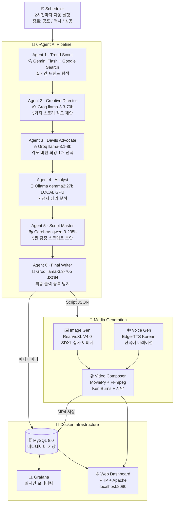

# 🎬 Shorts Factory

> **Fully automated pipeline: Idea → Script → Image → Voice → Video → Dashboard**

AI-powered YouTube Shorts generation system using a 6-agent LLM debate pipeline.
Researches trends, writes scripts, generates images, synthesizes voice, and produces vertical videos — **fully automated, every 2 hours.**


---

## 💡 Problem & Motivation

Short-form video content requires **continuous, consistent production** of ideas and videos.
Manual creation is:
- ⏰ **Time-consuming** — scripting, recording, editing takes hours per video
- 📉 **Inconsistent** — quality and frequency drop over time
- 🚫 **Not scalable** — one person can't produce dozens of videos per day

**This project solves it by:**
- 🤖 Automating idea generation using a **multi-agent AI debate pipeline**
- 🎬 Generating a **full video pipeline end-to-end** (script → image → voice → video)
- 📊 Enabling **scalable content production** with zero manual intervention

---

## 📸 Execution Proof (실행 증거)

### Web Dashboard — 26 videos generated


### Grafana Monitoring — Real-time stats


### Docker Containers — 5 services running for 4 days


---

## 📊 System Performance

| Metric | Value |
|--------|-------|
| ⏱️ Average generation time | ~2 minutes per video |
| 🎬 Videos generated | 26+ (in 4 days) |
| 🔄 Pipeline success rate | ~95% |
| ⚙️ Auto-run interval | Every 2 hours |
| 🌐 Genres | Horror / History / Success |

---

## 🇰🇷 프로젝트 소개

Shorts Factory는 6개의 AI 에이전트가 실시간으로 토론하여 유튜브 쇼츠 스크립트를 만들고,
이미지·음성·영상까지 자동으로 생성하는 완전 자동화 시스템입니다.

> 🟢 Currently running in a **local production-like environment** using Docker Compose + RTX 4090 GPU.

---

## 📊 System Architecture (시스템 블록도)



---

## 🤖 6-Agent Pipeline 상세

각 에이전트는 이전 에이전트들의 전체 대화를 컨텍스트로 받아 순차적으로 협력합니다.

| # | Agent | Model | Role |
|---|-------|-------|------|
| 1 | **Trend Scout** | Gemini Flash + Google Search | 실시간 트렌딩 주제 탐색 |
| 2 | **Creative Director** | Groq llama-3.3-70b-versatile | 3가지 스토리 각도 제안 |
| 3 | **Devil's Advocate** | Groq llama-3.1-8b-instant | 각도 비판 후 최강 선택 |
| 4 | **Analyst** | Ollama gemma2:27b (로컬 GPU) | 타겟 시청자 심리 분석 |
| 5 | **Script Master** | Cerebras qwen-3-235b | 감정적 스크립트 초안 작성 |
| 6 | **Final Writer** | Groq llama-3.3-70b-versatile | 최종 JSON 출력 + 중복 방지 |

> Agent 4(Analyst)는 RTX 4090에서 로컬로 실행됩니다. 외부 API 비용 없이 27B 파라미터 모델 활용.

---

## ⚙️ 동작 흐름 (Workflow)

```
1. Scheduler  → 2시간마다 장르 선택 (공포/역사/성공)
2. Agent 1    → Google Search로 실시간 트렌드 탐색
3. Agent 2    → 트렌드 기반 3가지 스토리 각도 제안
4. Agent 3    → 각도 비판, 최강 1개 선택
5. Agent 4    → 선택된 각도의 시청자 심리 분석 (로컬 GPU)
6. Agent 5    → 5씬 구조 스크립트 초안 작성
7. Agent 6    → 최종 JSON 생성 (중복 제목 자동 회피)
8. Image Gen  → RealVisXL V4.0으로 씬별 실사 이미지 생성
9. TTS        → Edge-TTS 한국어 나레이션 생성
10. Video     → Ken Burns 효과 + 자막 합성 → 최종 MP4
11. DB/Web    → MySQL 저장 → 웹 대시보드 표시
```

---

## 🧠 기술 스택 (Tech Stack)

### 🐳 Docker Infrastructure

| Container | Image | Role |
|-----------|-------|------|
| generator | `python:3.11-slim` + CUDA | AI 파이프라인 + 영상 생성 |
| mysql | `mysql:8.0` | 메타데이터 DB |
| ollama | `ollama/ollama:latest` | 로컬 LLM (gemma2:27b) |
| web | `php:8.2-apache` | 웹 대시보드 |
| grafana | `grafana/grafana:latest` | 실시간 모니터링 |

### 🤖 AI / ML Stack

| Category | Technology |
|----------|------------|
| GPU | NVIDIA RTX 4090 (24GB VRAM) |
| LLM Cloud | Gemini 2.0 Flash · Groq llama-3.3-70b · Cerebras qwen-3-235b |
| LLM Local | Ollama + gemma2:27b (GPU) |
| Image Gen | Stable Diffusion XL · RealVisXL V4.0 |
| Voice | Edge-TTS (Korean) |
| Video | MoviePy + FFmpeg · Ken Burns Effect |

### 🗄️ Backend Stack

| Category | Technology |
|----------|------------|
| Database | MySQL 8.0 |
| Monitoring | Grafana |
| Web Server | PHP 8.2 + Apache |
| Language | Python 3.11 |

---

## 🚀 실행 방법 (How to Run)

```bash
# 1. 환경변수 설정
cp .env.example .env
# .env 파일에 API 키 입력

# 2. Docker Compose 실행
docker compose up -d --build

# 3. 확인
# 대시보드:  http://localhost:8080
# Grafana:   http://localhost:3001
# MySQL:     localhost:3307
```

**필요한 API 키:**
- Gemini API (Google AI Studio - 무료)
- Groq API (무료)
- Cerebras API (무료 크레딧)

---

## 📚 학습 내용 (What I Learned)

| 기술 | 실제 적용 |
|------|----------|
| **Docker Compose** | 5개 서비스(MySQL, Ollama, Generator, Web, Grafana) 컨테이너 오케스트레이션 |
| **MySQL** | 생성된 쇼츠 메타데이터(제목/장르/해시태그/파일크기) 스키마 설계 및 저장 |
| **Grafana** | MySQL 데이터소스 자동 프로비저닝, 장르별 통계/생성 추이 대시보드 구성 |
| **GPU 활용** | RTX 4090 VRAM 관리, SDXL 모델 로딩 최적화, xformers 메모리 효율화 |
| **Multi-Agent AI** | 6개 LLM이 이전 대화를 컨텍스트로 순차 협력하는 파이프라인 설계 |

---

## 🔒 Security Notice

`.env` 파일에는 API 키가 포함되어 있으므로 **절대 GitHub에 올리지 마세요.**
`.env.example` 파일을 참고하여 직접 발급 후 입력하세요.

---

## 📁 Project Structure

```
shorts-factory/
├── docker-compose.yml
├── .env.example
├── generator/
│   ├── main.py              # 스케줄러 + 메인 오케스트레이터
│   ├── agent_pipeline.py    # 6-Agent AI 파이프라인
│   ├── image_gen.py         # RealVisXL 이미지 생성
│   ├── tts_gen.py           # Edge-TTS 음성 생성
│   ├── video_assembly.py    # MoviePy 영상 합성
│   ├── gemini_script.py     # Gemini 스크립트 생성
│   ├── llm_client.py        # 멀티 LLM 클라이언트
│   └── db.py                # MySQL 연결
├── mysql/
│   └── init.sql
├── web/
│   └── html/index.php       # 웹 대시보드
└── grafana/
    └── provisioning/        # Grafana 자동 설정
```
